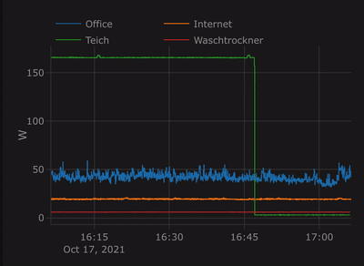
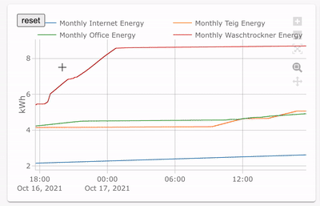

# Plotly Graph Card




## Install through HACS

1. Go to `HACS` / `Frontend` / `click [⋮] on the top right` / `Custom Repositories`
2. Paste the url of this repo
3. Select `Lovelace` as Category
4. Close the popup
5. Click install under in the new `Plotly Graph Card` box.

## Card Config

_**New**_ Visual Config editor available for Basic Configs (*)

```yaml
type: custom:plotly-graph
entities:
  - sensor.monthly_internet_energy
  - sensor.monthly_teig_energy
  - sensor.monthly_office_energy
  - sensor.monthly_waschtrockner_energy
hours_to_show: 24
refresh_interval: 10
```

(*) I'm reusing the editor of the standard History Card. Cheap, yes, but it works fine
## Advanced

```yaml
type: custom:plotly-graph
entities:
  - entity: sensor.monthly_internet_energy
    fill: tozeroy
    line:
      color: red
      dash: dot
      width: 5

  - entity: sensor.monthly_office_energy
  - entity: sensor.monthly_waschtrockner_energy
layout:
  plot_bgcolor: pink
config:
  scrollZoom: true

hours_to_show: 24
refresh_interval: 10 # in seconds
```

## Features

- Anything you can do with scatter and barcharts in plotly
- Zoom / Pan, etc.
- Data is loaded in the background
- Axes are automatically configured based on the units of each trace
- Configuration compatible with the History Card

For now only the only allowed chart types are:

- Bar charts https://plotly.com/javascript/bar-charts/#basic-bar-chart
- Line and scatter https://plotly.com/javascript/line-and-scatter/

## entities:

- `entities` translates to the `data` argument in PlotlyJS

  - each `entity` will be translated to a trace inside the data array.
    - `x` (states) and `y` (timestamps of stored states)
    - you can add any attribute that works in a trace

- see https://plotly.com/javascript/reference/scatter/#scatter-line for more

## layout:

To define layout aspects, like margins, title, axes names, ...
Anything from https://plotly.com/javascript/reference/layout/.

## config:

To define general configurations like enabling scroll to zoom, disabling the modebar, etc.
Anything from https://plotly.com/javascript/configuration-options/.

## hours_to_show:

How many hours are shown.
Exactly the same as the history card, except decimal values (e.g `0.1`) do actually work

## refresh_interval:

Update data every `refresh_interval` seconds. Use `0` or delete the line to disable updates

# Development

- Clone the repo
- run `npm i`
- run `npm start`
- From a dashboard in edit mode, go to `Manage resources` and add `http://127.0.0.1:8000/plotly-graph-card.js` as url with resource type JavaScript
- ATTENTION: The development card is `type: custom:plotly-graph-dev`

# Build

`npm run build`

# Release

- `npm version minor`
- git push

Proper HACS integration and automated release pending.
